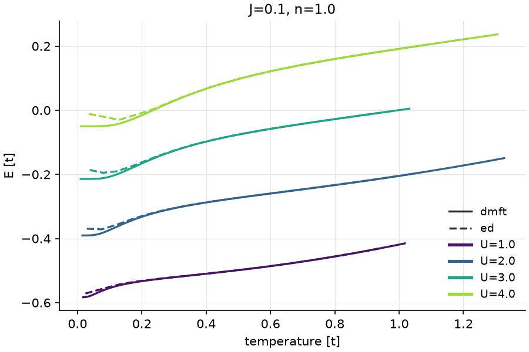
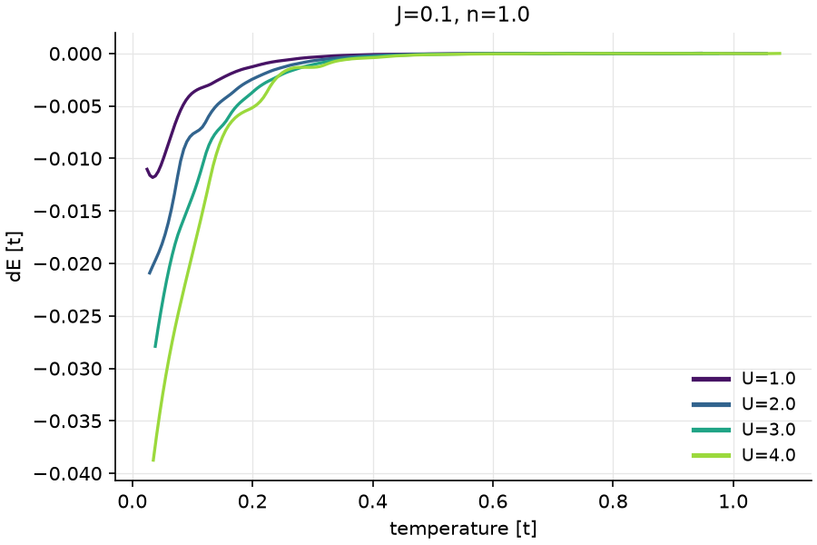
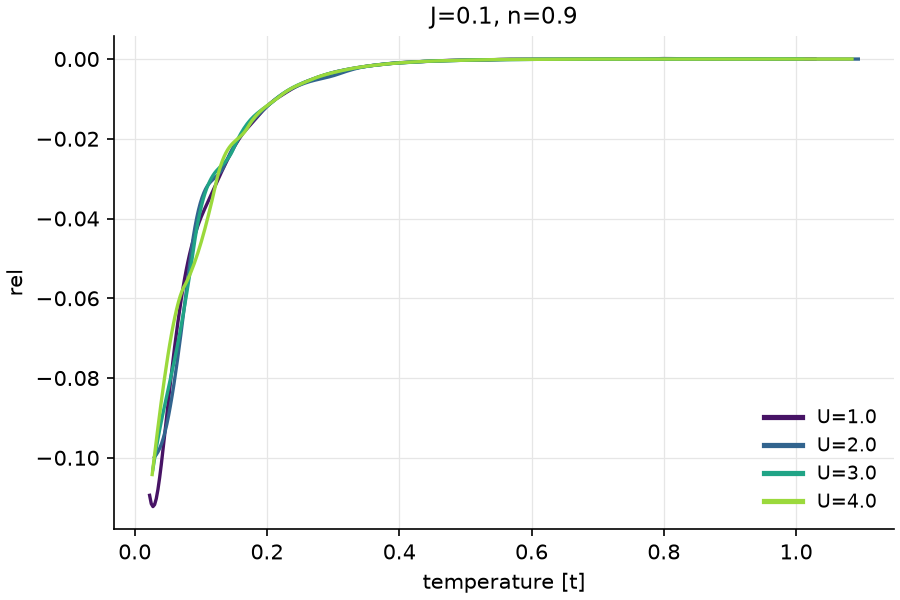
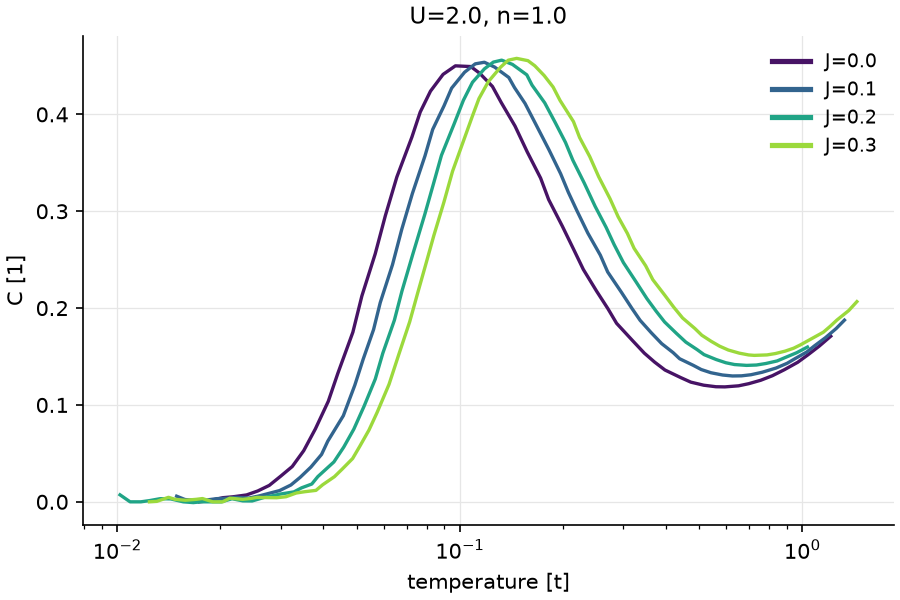
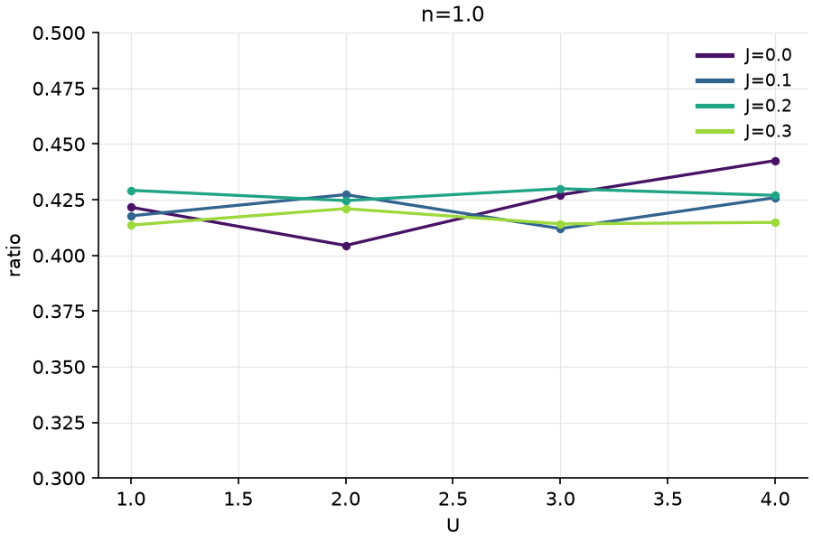
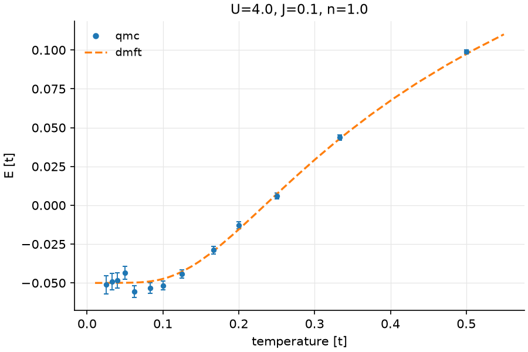
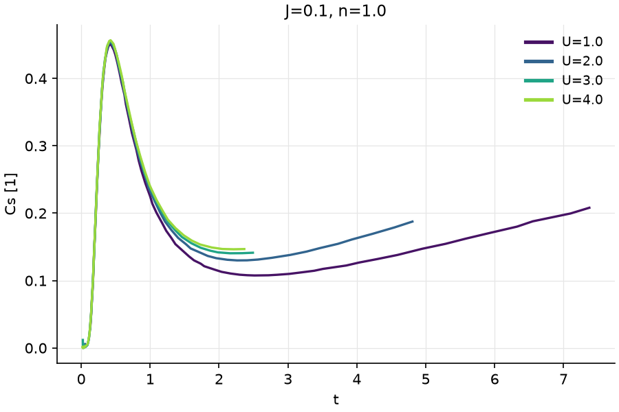
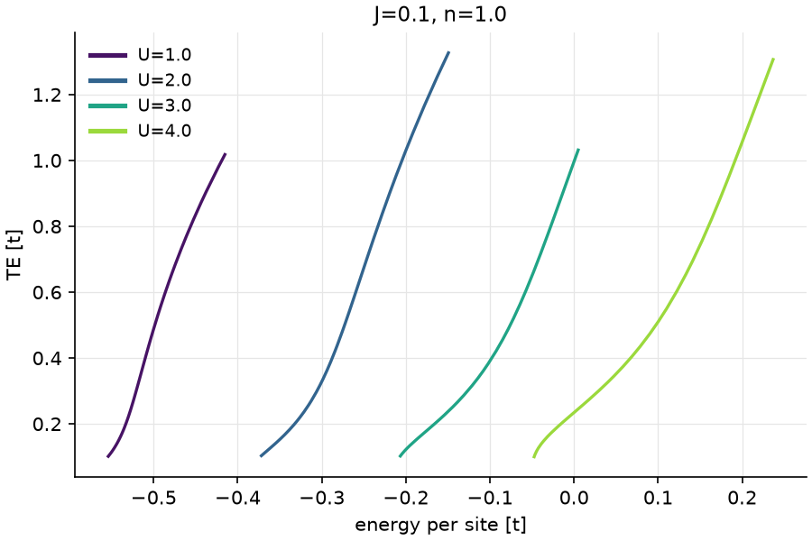

# Example: a Hubbard-like parameter sweep

Synthetic simulation output that behaves like the real thing: four sources,
different temperature grids in every file, missing runs, a repeated row, and
noisy data with error bars.

| Table | Source | What's in it |
|---|---|---|
| `dmft` | `data/dmft/U_*/J_*/n_*.dat` | E(T), 40–80 log-spaced T points, a different grid per file |
| `ed` | `data/ed/U_*/J_*/n_*.dat` | E(T) from a small cluster: 12–24 points, a finite-size error at low T, no runs for U=4 n=0.8, and one file with a repeated T row |
| `qmc` | `data/qmc.db` (SQLite) | Noisy E with error bars, stored by β = 1/T, only J=0.1 n=1.0 |
| `gap` | `data/gap/U_*/J_*/n_*.dat` | One gap value per run (a keyed table, no axis) |

The model is a two-level excitation with gap Δ(U, J, n) plus a T² term, so
the specific heat C = dE/dT has a peak near T ≈ 0.42 Δ. The analysis checks
that.

## Run it

```
pip install -e ../..          # from the repo root: pip install -e .
python make_data.py           # already done, the data is committed
glue run --trust analysis.glue
```

`--trust` allows the project's Python plugin (`ops/physops.py`, which adds
`fwhm`) to load. `run_log.txt` has the full output of the last run.

The same analysis from Python is in `analysis.py`.

## Files

- `project.toml`: the four tables, two views (`dE`, `C`), settings, the plugin, and the saved datasets
- `tables/*.toml`: one interface file per source. Each `[field]` section gives the type, for example `[U, J, n, T → E]` with `T` as the axis
- `analysis.glue`: the script that makes everything in `figs/`, `results/`, and `exports/`
- `results/`: saved datasets. Each one is a TOML file with the calculation tree (see `docs/core.md`), plus a Parquet cache

The project sets `fingerprint = "hash"`. A git clone resets file times, so
the saved datasets compare file contents instead. That way they stay fresh
after a clone.

## Figures

| | |
|---|---|
|  `plot dmft=dmft.E, ed=ed.E by U where J=0.1, n=1.0` |  `plot dE by U where J=0.1, n=1.0`, where `dE = dmft.E - ed.E` is aligned onto a common grid |
|  `(dmft.E - ed.E) / gap.gap`: dividing by the gap makes the curves collapse |  `plot C by J where U=2.0, n=1.0 with logx`, where `C = d(dmft.E, T)` |
|  `argmax(C) / gap.gap`: close to 0.42, as the model predicts |  QMC from SQLite, with error bars, against DMFT |
|  `transform(C, T, t = T / gap.gap)`: with T in units of the gap, the peaks line up |  `swap(dmft.E[T=0.1:], T)`: T as a function of E |

## When the data changes

`update_demo.sh` reruns three simulations and refreshes what depends on
them. Output from a run:

```
rewrote data/ed/U_2.0/J_0.1/n_1.0.dat
rewrote data/ed/U_3.0/J_0.1/n_1.0.dat
rewrote data/dmft/U_3.0/J_0.2/n_1.0.dat

$ glue status
dE_fine        stale      dmft: 1 changed (U_3.0/J_0.2/n_1.0.dat)
                          ed: 2 changed (U_2.0/J_0.1/n_1.0.dat, ...)
Tpeak          stale      dmft: 1 changed (U_3.0/J_0.2/n_1.0.dat)
ratio          stale      Tpeak: depends on a stale dataset
C_log          stale      dmft: 1 changed (U_3.0/J_0.2/n_1.0.dat)

$ glue refresh --all
dE_fine: recomputed 3 of 44 curves, 41 unchanged
Tpeak: recomputed 1 of 48 keys, 47 unchanged
ratio: recomputed all 48 keys
C_log: recomputed 1 of 48 curves, 47 unchanged
```

`ratio` is built from the saved dataset `Tpeak`, so it goes stale when
`Tpeak` does, and it's refreshed after it. A dataset input is tracked as a
whole, so all of `ratio` is recomputed.

To force a recompute without changing any files, mark a leaf as changed:

```
> invalidate ed where U=2.0
> why dE_fine
> refresh dE_fine
```

The script changes files under `data/` and `results/`. `python make_data.py`
puts the data back, and `glue refresh --all` updates the results to match.
