# glue, step by step: thermodynamics of a spin chain

This tutorial walks through every part of glue on a realistic dataset. You describe data spread
over many files in four formats, combine it, do calculus on it, change variables, extend glue with
Python, save results, and watch them update when the data changes. At the end there's a tour of
how the code does it.

Every command below was run, and the output under it is what glue printed. The figures are the
ones those commands made. `build_tutorial.py` rebuilds this file from `TUTORIAL.src.md`.

**Contents**

1. [The physics and the data](#1-the-physics-and-the-data)
2. [Describing the files](#2-describing-the-files)
3. [A project and a first look](#3-a-project-and-a-first-look)
4. [Fields: what every value is](#4-fields-what-every-value-is)
5. [Plotting](#5-plotting)
6. [Messy files: a restarted job](#6-messy-files-a-restarted-job)
7. [Combining sources](#7-combining-sources)
8. [Calculus on curves](#8-calculus-on-curves)
9. [Changing variables](#9-changing-variables)
10. [Your own operations in Python](#10-your-own-operations-in-python)
11. [Settings](#11-settings)
12. [Saving results](#12-saving-results)
13. [When the data changes](#13-when-the-data-changes)
14. [Exporting](#14-exporting)
15. [The Python API](#15-the-python-api)
16. [The command line](#16-the-command-line)
17. [How it works inside](#17-how-it-works-inside)

---

## 1. The physics and the data

The model is the spin-1/2 XXZ chain with periodic boundaries:

    H = J Σ_i [ Sx_i Sx_i+1 + Sy_i Sy_i+1 + Δ Sz_i Sz_i+1 ] − h Σ_i Sz_i ,   J = 1

Δ is the anisotropy and h a magnetic field. Δ = 0 is the XX chain (free fermions), Δ = 1 the
Heisenberg chain. We want the energy E, specific heat C, magnetization M, and susceptibility χ per
site as functions of temperature T, and we want to know how they depend on the chain length L.

`make_data.py` computes all of it with real numerics. There's nothing made up here:

| Source | Method | Format | What's odd about it |
|---|---|---|---|
| `data/ed/L_*/Delta_*/h_*.dat` | full exact diagonalization, L = 8 to 14 | one text file per run | every run picked its own temperatures; one job was restarted and wrote some rows twice; one job never finished |
| `data/ftlm.db` | finite-temperature Lanczos, L = 16 and 18, h = 0 | SQLite | another code: it calls Δ `jz`, stores β = 1/T, writes energies for the whole chain, and has statistical error bars |
| `data/gap.h5` | Lanczos ground states, L = 8 to 18 | HDF5, one group per run | one number per run, no temperature |
| `data/exact/xx_h*.csv` | the exact infinite XX chain (Δ = 0) | CSV | long column names, and no L at all |

```sh
python make_data.py
```

Here's what one ED run looks like. Note the two header lines, and that the temperatures are
this run's own:

```show data/ed/L_12/Delta_1.0/h_0.0.dat lines=1-6
```

The FTLM database, and the HDF5 file:

```python
import sqlite3, h5py
con = sqlite3.connect("data/ftlm.db")
print(con.execute("SELECT sql FROM sqlite_master").fetchone()[0])
for row in con.execute("SELECT L, jz, beta, e_tot, e_err FROM ftlm WHERE L = 16 AND jz = 1.0 LIMIT 3"):
    print(row)
with h5py.File("data/gap.h5") as f:
    print(sorted(f.keys()), sorted(f["L_12"].keys()), f["L_12/Delta_1.0/data"][()])
```

The rest of this tutorial turns these four very different sources into one consistent picture:

```python hidden
import sys, os
sys.path.insert(0, os.getcwd())
import diagrams as D
D.pipeline("figs/diagram_pipeline.png")
```

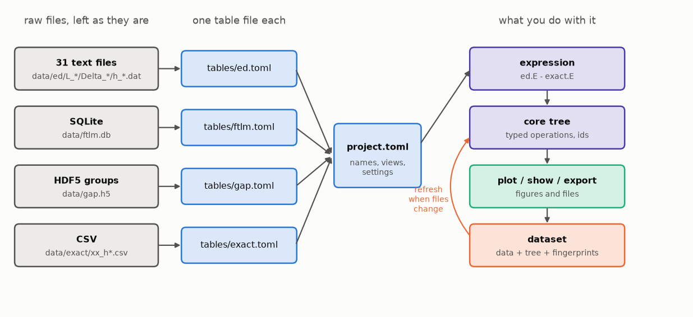

## 2. Describing the files

glue never converts or moves your data. Instead, each source gets a small **table file** in TOML
that says where the files are and what's in them.

### Let glue guess

For a folder of files, `guess` looks at the folder names and the first file and suggests a table
file. It writes nothing:

```glue
guess data/ed name=ed
```

It found L, Delta, and h in the folder names, and the column names in the header comment. It
guessed that the first column, T, is the axis. We'll write the real file by hand, with two
changes: `L` is an integer, and the columns get labels and units for the plots.

### Exact diagonalization: text files in folders

```toml write=tables/ed.toml
glue = "0.2"
kind = "table"
description = "Full exact diagonalization of periodic XXZ chains, L = 8 to 14. One file per run."

[source]
locator = "glob"
root = "../data/ed"
pattern = "L_{L:int}/Delta_{Delta}/h_{h}.dat"

[source.reader]
format = "text"
columns = ["T", "E", "C", "M", "chi"]

[field]
inputs = ["L", "Delta", "h", "T"]
outputs = ["E", "C", "M", "chi"]
axis = "T"

[columns.L]
label = "chain length"

[columns.Delta]
label = "anisotropy"

[columns.h]
unit = "J"
label = "field"

[columns.T]
unit = "J"
label = "temperature"

[columns.E]
unit = "J"
label = "energy per site"

[columns.C]
label = "specific heat per site"

[columns.M]
label = "magnetization per site"

[columns.chi]
unit = "1/J"
label = "susceptibility per site"
```

- `[source]` says where the files are. `{L:int}`, `{Delta}`, and `{h}` capture values from the
  path. They're called **path inputs**.
- `[source.reader]` says how to read one file.
- `[field]` is the table's **type**: the inputs identify a point, the outputs are measured there,
  and the **axis** is the input that operations like `d` and `max` work along by default.
- `[columns.*]` adds units and labels, which the plots use.

### FTLM: a database with other conventions

This code differs in three ways. It calls Δ `jz`, it stores β instead of T, and its energies are
for the whole chain. Fix that once, in the table file, and every expression afterwards sees the
same names and units as the ED table:

```toml write=tables/ftlm.toml
glue = "0.2"
kind = "table"
description = """Finite-temperature Lanczos for L = 16 and 18 at h = 0. This code has its own
conventions: it calls Delta jz, stores beta = 1/T, and writes energies for the whole chain.
The [field] sections below turn that into the same names and units as the ED table."""

[source]
locator = "sqlite"
file = "../data/ftlm.db"
query = "SELECT L, jz AS Delta, beta, e_tot, e_err, cv_tot, cv_err FROM ftlm"
constants = { h = 0.0 }

[field]
inputs = ["L", "Delta", "h", "T"]
outputs = ["E", "C"]
axis = "T"

[field.transform]
T = { from = "beta", formula = "1 / beta" }

[field.map]
E = "e_tot / L"
dE = "e_err / L"
C = "cv_tot / L"
dC = "cv_err / L"

[columns.L]
type = "int"
label = "chain length"

[columns.T]
unit = "J"
label = "temperature"

[columns.E]
unit = "J"
label = "energy per site"
error = "dE"

[columns.C]
label = "specific heat per site"
error = "dC"
```

- The SQL `query` renames `jz` to `Delta`. Any SELECT works.
- `constants` adds an input with the same value everywhere: this code only ran at h = 0.
- `[field.transform]` replaces the input β with T = 1/β.
- `[field.map]` computes outputs from columns: energies per site, and their errors.
- `error = "dE"` marks `dE` as the error bar of `E`. It comes along with `E`, and
  `plot ... with errorbars` draws it.

### Gaps: an HDF5 file

```toml write=tables/gap.toml
glue = "0.2"
kind = "table"
description = "Spin gap E0(Sz=1) - E0(Sz=0) and ground-state energy per site, from Lanczos. One HDF5 group per run."

[source]
locator = "hdf5"
file = "../data/gap.h5"
pattern = "L_{L:int}/Delta_{Delta}"

[source.reader]
format = "dataset"
dataset = "data"
columns = ["gap", "e0"]

[field]
inputs = ["L", "Delta"]
outputs = ["gap", "e0"]

[columns.gap]
unit = "J"
label = "spin gap"

[columns.e0]
unit = "J"
label = "ground-state energy per site"
```

This table has no axis: one value per (L, Delta). That's a **keyed table**.

### The exact XX chain: CSV

```toml write=tables/exact.toml
glue = "0.2"
kind = "table"
description = "The exact infinite XX chain (Delta = 0), from free fermions. CSV with long column names."

[source]
locator = "glob"
root = "../data/exact"
pattern = "xx_h{h}.csv"
constants = { Delta = 0.0 }

[source.reader]
format = "csv"
rename = { temperature = "T", energy = "E", heat_capacity = "C", magnetization = "M", susceptibility = "chi" }

[field]
inputs = ["Delta", "h", "T"]
outputs = ["E", "C", "M", "chi"]
axis = "T"

[columns.T]
unit = "J"
label = "temperature"

[columns.E]
unit = "J"
label = "energy per site"
```

The CSV header gives the column names, and `rename` maps them to the short ones. The file is
for an infinite chain, so this table has no L. We'll see in section 7 that this is exactly
right: comparing it with ED uses the same exact curve for every L.

## 3. A project and a first look

A **project** file names the tables and holds shared settings. Views, calcs, and datasets get
added to it as you work.

```toml write=project.toml
glue = "0.2"
kind = "project"
name = "spinchain"
description = "Thermodynamics of the spin-1/2 XXZ chain from exact diagonalization, FTLM, and the exact XX solution"

[tables]
ed    = "tables/ed.toml"
ftlm  = "tables/ftlm.toml"
gap   = "tables/gap.toml"
exact = "tables/exact.toml"

[settings]
method = "pchip"
grid = "overlap(n=200)"
fingerprint = "hash"

[plot]
cmap = "viridis"
```

`fingerprint = "hash"` makes glue compare file contents rather than modification times, so the
saved results stay valid after a git clone. Now load it and look around. `info` works from the
file index, so it never opens a data file:

```glue
load project.toml
ls
info ed
info ftlm
info gap
values ed.Delta
```

Note that `info ed` counts 31 files, not 32: the L = 14, Δ = 1.5, h = 0.5 job never finished. glue
doesn't need a complete grid.

Anything that isn't a command is an expression to show:

```glue
ed.E where L=8, Delta=1.0, h=0.0 limit 5
gap.gap where Delta=1.0
ftlm.E where L=16, Delta=1.0 limit 3
```

The FTLM values arrive per site and by T, with their error column, because of the table file.

### Reading only what's needed

Data is read lazily. `explain` shows what a statement would read, without reading it:

```glue
explain ed.C where L=12, Delta=1.0
```

The filter went all the way down to the source, which only opens the 2 matching files:

```python hidden
D.files_read(session, "ed.C", "L=12, Delta=1.0", "figs/diagram_read_one.png",
             "explain ed.C where L=12, Delta=1.0: the files that are opened")
```

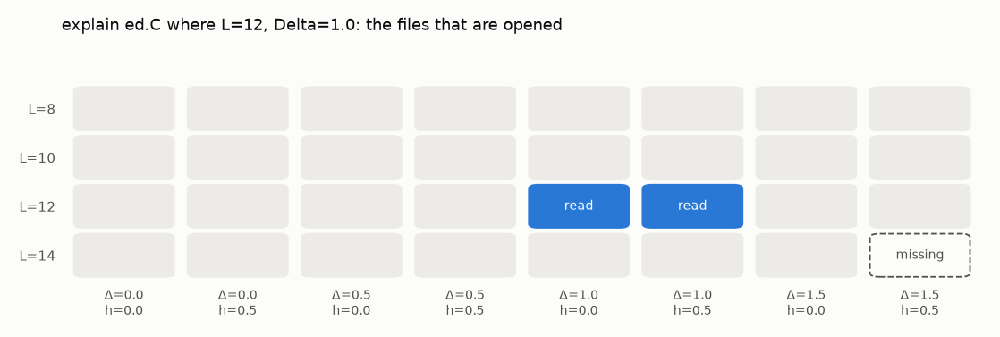

## 4. Fields: what every value is

Every value in glue is a **field**, written `[inputs → outputs]`. The inputs determine the
outputs. `info` showed `ed : [L, Delta, h, T:ragged → E, C, M, chi]`.

Each input is either **exact** or **ragged**:

- **Exact** inputs take values from a fixed set, like L = 8, 10, 12, 14. Two fields are matched on
  them by value.
- **Ragged** inputs have different values in every curve. T is ragged here, because each run chose
  its own temperatures. To combine two fields along T, glue interpolates onto a common grid.

In a table, every input except the axis is exact. The axis is ragged, unless you declare it exact
in `[field].exact` because every file uses the same points.

A **curve** is the set of points with the same values of every input except the axis. `ed` has 31
curves, one per file. `gap` has none: it's keyed, one value per (L, Delta).

Operations change the type, and glue works it out before reading any data:

```glue
explain max(ed.C)
explain ed.E @ T=0.5
```

`max` along T removes T: one number per curve. `@ T=0.5` evaluates each curve at one temperature
and also removes T.

## 5. Plotting

Plot the specific heat of the Heisenberg chain for each chain length:

```glue
plot ed.C by L where Delta=1.0, h=0.0 with logx > figs/05_C_by_L.png
```

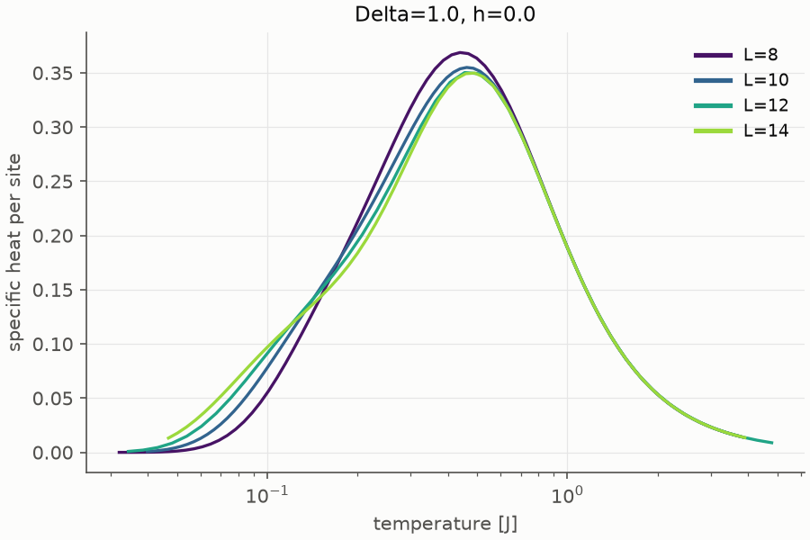

`by L` colors the curves by L, `where` fixes the other inputs, and `with logx` is a plot option.
The axis labels come from the table's `[columns]`.

**Every input must be fixed, colored, or on the x axis.** Otherwise curves for different values
would overlap in the same color. If you forget one, glue says so:

```glue
plot ed.C where Delta=0.5
```

If exactly one input is free, glue uses it for the colors. Two by-inputs use color and line style:

```glue
plot ed.chi by L, h where Delta=0.5 with logx > figs/05_chi_by_L_h.png
```

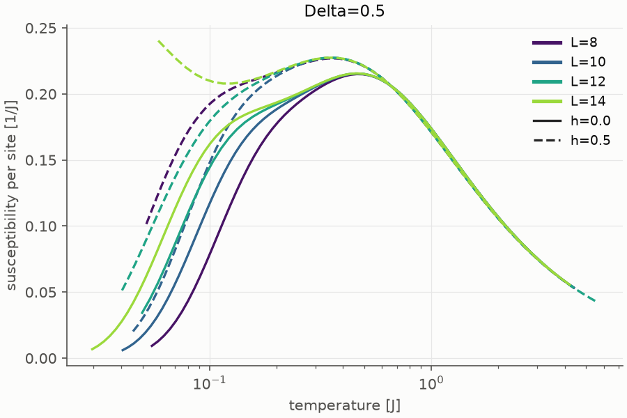

The field (dashed) polarizes the chain and suppresses the susceptibility at low temperature.

Several expressions go on the same axes, told apart by line style. `name=expr` sets the legend
name, and `errorbars` draws the FTLM error bars:

```glue
plot ed=ed.C, ftlm=ftlm.C by L where Delta=1.0, h=0.0 with logx, errorbars > figs/05_ed_ftlm.png
```

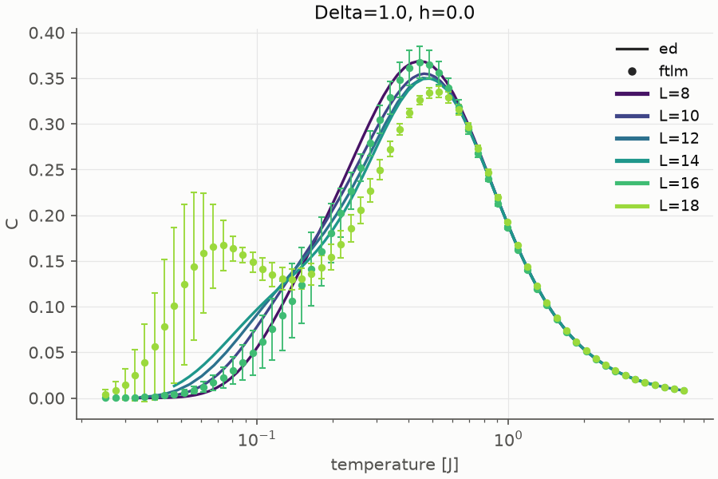

The Lanczos data for L = 16 and 18 agrees with ED above T ≈ 0.3. Below that its statistical errors
grow and a spurious bump appears, a known artifact of FTLM with few random vectors. That's the kind
of thing you want to see before trusting a number.

A keyed field is plotted against one of its inputs with `vs`:

```glue
plot gap.gap vs L by Delta > figs/05_gap_vs_L.png
```

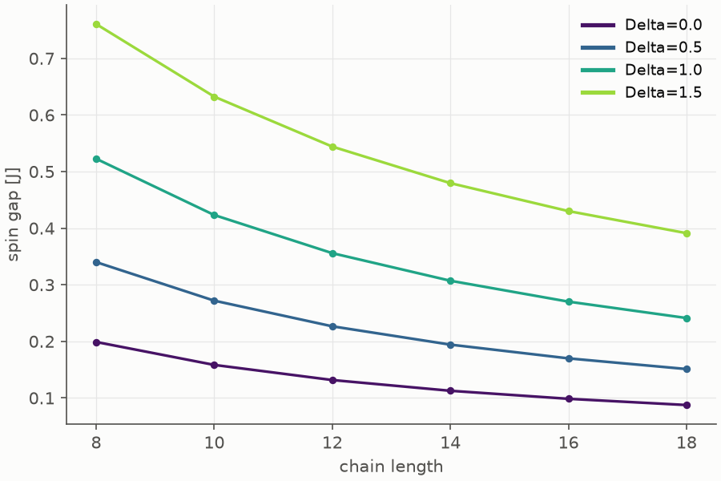

`plot + ...` adds to the current figure:

```glue
plot ed.E where L=14, Delta=0.0, h=0.0 with logx > figs/05_plus.png
plot + exact.E where h=0.0 > figs/05_plus.png
```

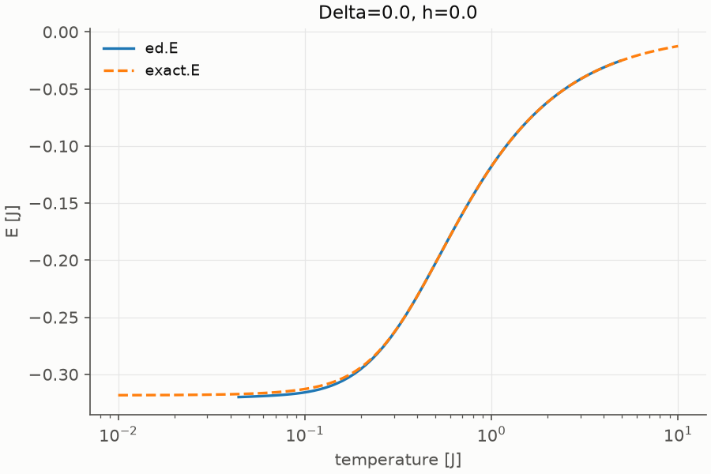

## 6. Messy files: a restarted job

One job, L = 12, Δ = 1.0, h = 0.5, crashed and was restarted. It wrote some temperatures twice.
Reading it stops with an error that names the file:

```glue
ed.E where L=12, Delta=1.0, h=0.5
```

Here the repeated rows are identical, so keeping the first copy is right. `set` changes a
setting for the rest of the session:

```glue
set duplicates first
ed.E where L=12, Delta=1.0, h=0.5 limit 3
```

glue reports what it changed whenever it touches your data: repaired curves, dropped keys,
interpolation. The report is short by default. `set report full` lists every affected curve.

## 7. Combining sources

Compare ED with the exact infinite chain at Δ = 0:

```glue
dX = ed.E - exact.E
plot dX by L where Delta=0.0, h=0.0 with logx > figs/07_finite_size.png
```

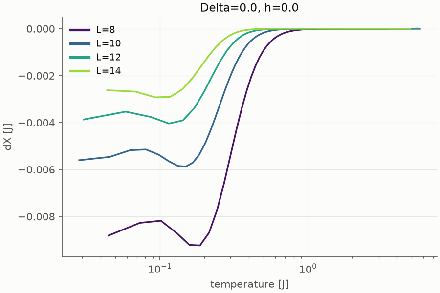

That one line did a lot, and the report says what:

- **Inputs are matched by name.** `exact.E` has no L, so the same exact curve is compared with
  every L. That's called broadcasting.
- **Exact inputs are joined by value.** Delta and h are matched.
- **Ragged inputs are aligned.** T is ragged, and the two sources have different temperatures. So
  for each curve, both are interpolated with `pchip` onto `overlap(n=200)`: 200 points spread over
  the T range both cover.

```python hidden
D.alignment(session, "figs/diagram_alignment.png")
```

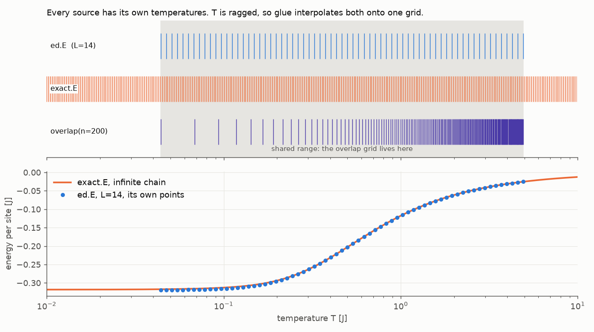

The finite-size error falls quickly with L, and it's largest at low T, where the finite chain's
gap matters. `explain` shows the calculation that glue built:

```glue
explain plot dX by L where Delta=0.0, h=0.0
```

```python hidden
D.tree(session.compile("dX")[0], "figs/diagram_tree_dX.png", "the core tree of dX = ed.E - exact.E")
```

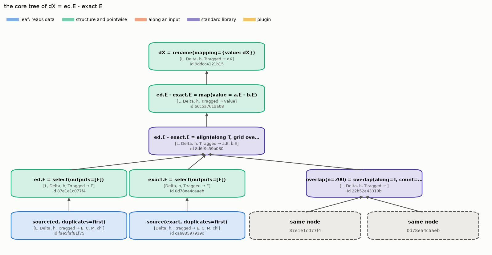

Each box is one core operation with its type and its id. `align` is a standard-library operation
made of resamples and a join. The overlap grid reads the same two selects: they're the same
nodes, so they're computed once.

### Operands that share their points

Fields from the same table under the same filter have exactly the same points, so they combine
point by point with no interpolation. The report says nothing about aligning. χT should approach
the Curie constant 1/4 at high temperature:

```glue
ed.T * ed.chi where L=8, Delta=1.0, h=0.0, T=3.0: limit 3
```

### A dimensionless keyed field

A keyed field acts as a constant along each curve. Dividing by the gap measures T in units of
each chain's own gap:

```glue
ed.T / gap.gap where L=8, Delta=1.5, h=0.0 limit 3
```

Keys that only one side has are dropped and reported. The specific-heat peak in units of the gap
needs both tables, and `gap` has L = 16 and 18, which ED doesn't:

```glue
argmax(ed.C) / gap.gap where Delta=1.5, h=0.0
```

The ratio grows with L. The peak barely moves, while the finite-size gap shrinks: at Δ = 1.5 the
peak is set by the exchange J, not by the small gap.

## 8. Calculus on curves

### Derivatives: C = dE/dT

The ED files contain C, computed exactly from the spectrum. So we can check a numerical derivative
of E against it:

```glue
derr = d(ed.E, T) - ed.C
plot derr by L where Delta=1.0, h=0.0 with logx > figs/08_derivative_check.png
```

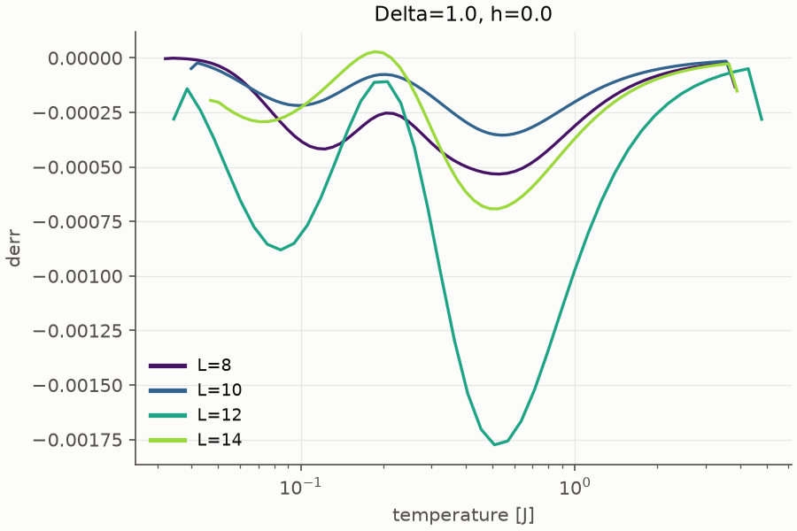

The error is below 2·10⁻³ on a C of about 0.35. `d` keeps the curve's points, so `d(ed.E, T)` and
`ed.C` share their points and nothing is interpolated. `d(y, T, method=fd)` uses finite
differences instead of the fitted spline.

### Integrals: the entropy

The entropy is S(T) = ∫ C/T dT. At high temperature it should approach ln 2 = 0.693 per site:

```glue
S = int(ed.C / T, T)
plot S by Delta where L=14, h=0.0 with logx > figs/08_entropy.png
S @ T=4.0 where L=14, h=0.0
```

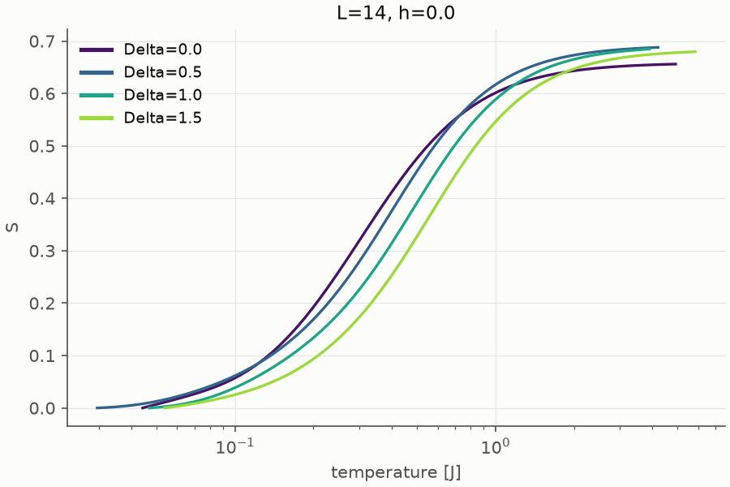

One value is NaN: that run stopped below T = 4, and outside the data glue gives NaN rather than
guess. The `extrapolate` setting can change that. `int` is the running integral from the first
point. `integral` integrates over the whole curve and
gives one number per curve. Since ∫ C dT = E(T_max) − E(T_min), this is a check too:

```glue
integral(ed.C, T) - (last(ed.E) - first(ed.E)) where Delta=1.0, h=0.0
```

### Reductions: one number per curve

`max`, `min`, `mean`, `sum`, `first`, `last`, `count`, `argmax`, and `argmin` reduce each curve to a
number. The temperature of the specific-heat peak:

```glue
Tpeak = argmax(ed.C)
plot Tpeak vs L by Delta where h=0.0 > figs/08_Tpeak.png
```

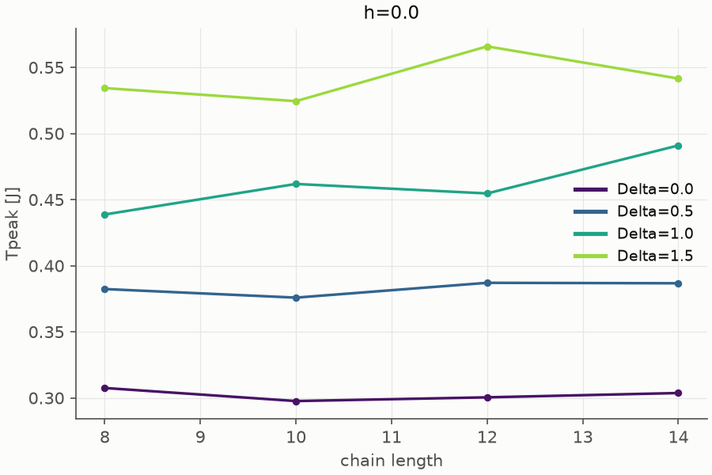

`argmax` gives a temperature, so its unit is the unit of T.

### Values at a point

`@` and `at` evaluate each curve at a point, or at a list of points:

```glue
ed.E @ T=0.5 where Delta=1.0, h=0.0
at(ed.E, T=[0.1, 1.0]) where L=14, Delta=1.0, h=0.0
```

### Resampling

`resample` puts curves on a grid you choose. On a fixed grid like `logspace`, T becomes exact, so
curves on the same grid match by value, with no further interpolation:

```glue
Eg = resample(ed.E, grid=logspace(0.1, 3.0, 60))
explain Eg
```

## 9. Changing variables

### transform: a new input from a formula

`transform(y, u, v = formula)` replaces input u with v. The gap should close like 1/L for a
gapless chain, so plot it against x = 1/L:

```glue
plot transform(gap.gap, L, x = 1 / L) vs x by Delta > figs/09_gap_vs_invL.png
```

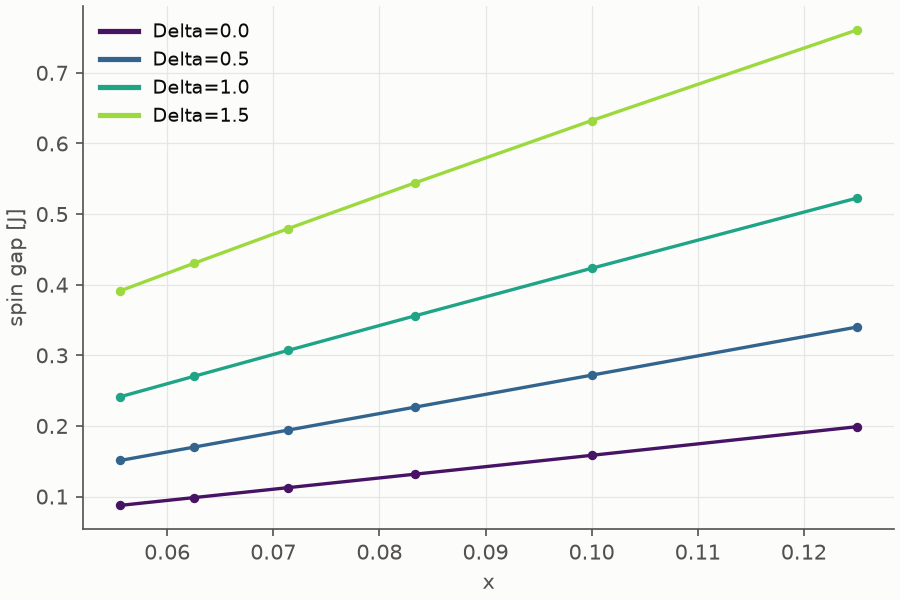

For Δ ≤ 1 the lines head to zero, and for Δ = 1.5 they don't: the Ising-like chain has a real gap.
Section 10 turns this into numbers.

A filter on the new input still skips files. glue works out from the file index that only L = 10
gives x = 0.1, and opens only those 4 groups:

```glue
explain transform(gap.gap, L, x = 1 / L) where x=0.1
```

### swap: trade an input for an output

E rises with T, so T is a function of E too. `swap` turns `[.., T → E]` into `[.., E → T]`:

```glue
TE = swap(ed.E[T=0.05:], T)
TE @ E=-0.3 where L=14, h=0.0
```

That's the temperature at which each chain has energy −0.3 per site. `swap` checks that every curve
is monotonic, and says which one isn't if it fails.

### legendre: the free energy

The entropy S(E) is concave, and its Legendre transform along E has slope β = 1/T and value
G = βE − S = F/T. Make S a function of E with `transform`, whose formula may use another field,
then apply `legendre`:

```glue
SE = transform(S, T, E = ed.E)
bF = legendre(SE, E, slope=beta, result=G)
bF where L=14, Delta=1.0, h=0.0 limit 3
```

At high temperature βF → −ln 2, as it should. Check it against F/T = E/T − S computed directly:

```glue
direct = transform(ed.E / T - S, T, beta = 1 / T)
max(abs(bF.G - direct)) where Delta=1.0, h=0.0
```

### Reducing along another input

A reduction can run along any input. Resample onto one grid first, then take the spread over
chain lengths at each temperature:

```glue
spread = max(Eg, L) - min(Eg, L)
plot spread by Delta where h=0.0 with logx, logy > figs/09_spread.png
```

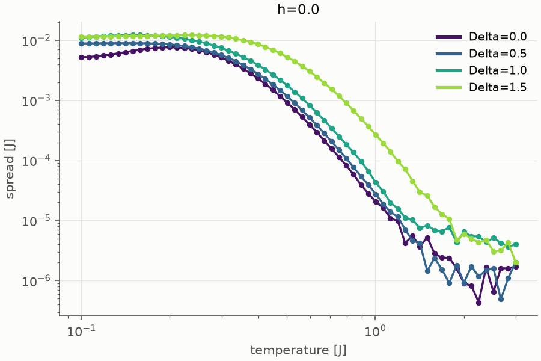

### stack and rename

`stack` puts fields with the same inputs together, with a new string input that says which one:

```glue
all_C = stack(ed=ed.C, ftlm=ftlm.C, tag="method")
max(all_C) where Delta=1.0, h=0.0
```

`rename(y, old=new)` renames inputs or outputs, for sources that disagree on names:

```glue
rename(gap.gap, L=N) where Delta=1.0
```

## 10. Your own operations in Python

For anything the built-in operations don't do, write a Python function. This one fits a
polynomial and returns its value at x = 0, which is how you extrapolate a finite-size result:

```python write=ops/fits.py
"""Custom operations for the spin chain tutorial. The project loads this module through [plugins]."""

import numpy as np

import glue


@glue.op(kind="reduce", version="1")
def intercept(x, y, deg=1):
    """Fit a polynomial of degree `deg` to y(x) and return its value at x = 0.

    With x = 1/L^2 this extrapolates a finite-size result to the infinite chain.
    """
    ok = np.isfinite(x) & np.isfinite(y)
    if ok.sum() <= deg:
        return np.nan
    return float(np.polyval(np.polyfit(x[ok], y[ok], int(deg)), 0.0))
```

Tell the project to load it. Plugins run code, so glue asks before loading them, or you pass
`--trust`:

```python
with open("project.toml", "a") as f:
    f.write('\n[plugins]\nmodules = ["fits"]\npath = ["ops"]\n')
```

```glue
reload
gap_inf = intercept(transform(gap.gap, L, x = 1 / L), x, deg=2)
gap_inf
```

The extrapolated gap is zero, within the accuracy of this fit, for Δ ≤ 1. For Δ = 1.5 it isn't:
the chain is gapped there.

The same idea extrapolates the energy at each temperature, using x = 1/L²:

```glue
Einf = intercept(transform(Eg, L, x = 1 / L^2), x)
plot Einf - exact.E where Delta=0.0, h=0.0 with logx > figs/10_extrapolation.png
```

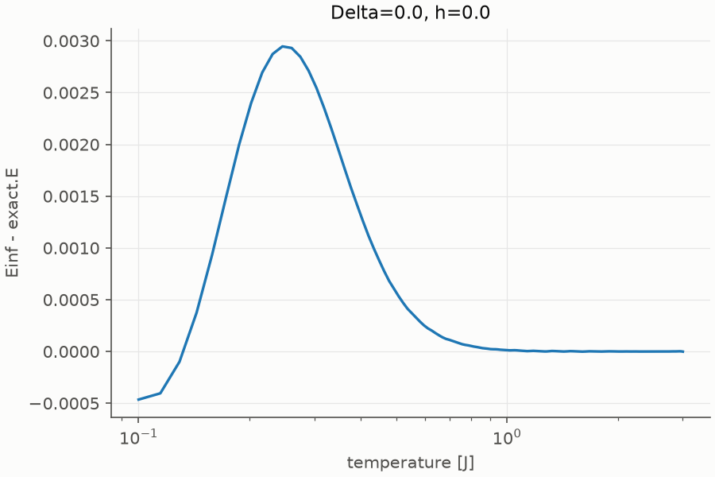

Against the exact XX result the extrapolation is good to 3·10⁻³, and exact above T ≈ 1. At low T the
1/L² form is too simple, since finite-size effects there are exponential.

```python hidden
D.tree(session.compile("Einf")[0], "figs/diagram_tree_Einf.png", "the core tree of Einf")
```

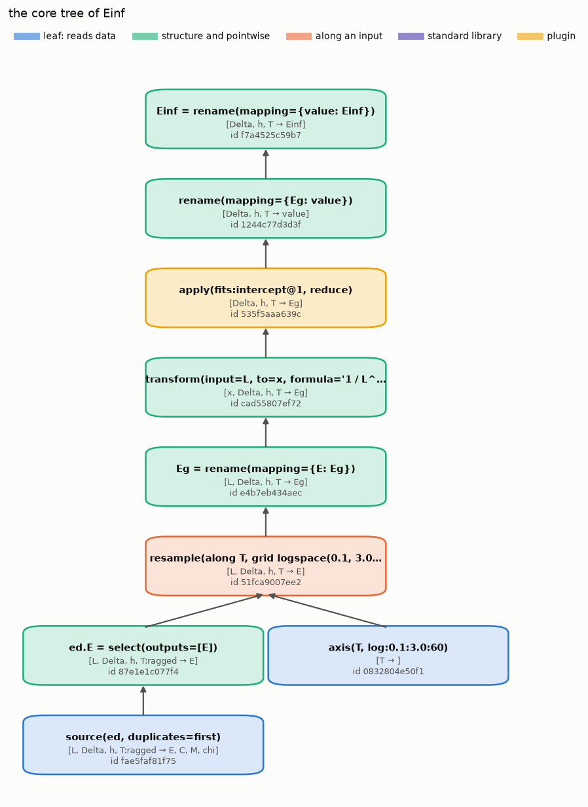

The plugin is an `apply` node. A saved result records it as `fits:intercept@1`.

## 11. Settings

`set` with no arguments shows every setting and where its value comes from:

```glue
set
```

There are four levels, and the closer one wins: `with` on one statement, `using(...)` inside an
expression, `set` for the session, `[settings]` in the project, and the defaults.

```glue
ed.E - exact.E where L=14, Delta=0.0, h=0.0 with method=linear, grid=logspace(0.05, 5, 100) limit 2
max(abs(using(ed.E - exact.E, method=cubic) - dX)) where Delta=0.0, h=0.0
```

A few settings change how fields combine:

- `align=[]` never interpolates, so fields are joined on exactly equal values. The two sources
  share no temperatures, so nothing is left:

```glue
ed.E - exact.E where L=14, Delta=0.0, h=0.0 with align=[]
```

- `strict=true` makes interpolation an error unless you asked for a grid:

```glue
ed.E - exact.E where Delta=0.0, h=0.0 with strict=true
```

- `extrapolate`, `fewpoints`, `unmatched`, `nan_rows`, and `branches` decide what happens at the
  edges of the data. The reference lists them all.

`unset` goes back to the project or default value.

## 12. Saving results

There are four kinds of names:

| Kind | Lives in | Follows current settings | Holds data |
|---|---|---|---|
| variable | this session | yes | no |
| view | `[views]` in the project | yes | no |
| calc | a `calcs/*.toml` file | no, fixed when saved | no |
| dataset | a `results/*.toml` file plus a cache | no, fixed when saved | yes |

`save` turns a variable into a dataset:

```glue
save Tpeak
save Einf
save dX --view
save gap_inf --recipe-only
ls
```

A dataset file holds the calculation as a tree of core operations, one TOML table per node,
followed by its type, its cache, and the fingerprints of the files it read:

```show results/Tpeak.toml lines=1-45 lang=toml
```

- Every parameter is written into the node that uses it, including the settings in effect, like
  `duplicates = "first"`. So the dataset means the same thing whatever your settings are later.
- A node's id is a hash of its operation, its parameters, and its inputs' ids. The same
  calculation always gets the same ids.
- A leaf's `def` id comes from what the table reads, not its name or where its file is. Renaming
  the table can't break the dataset, and two projects reading the same files share results.

A saved dataset is a table like any other, read from its cache:

```glue
info Tpeak
plot Tpeak vs L by Delta where h=0.0 > figs/12_saved_Tpeak.png
```


## 13. When the data changes

Two ED jobs are rerun with a finer temperature grid:

```sh
python make_data.py --rerun
```

```glue
status
why Tpeak
```

`status` compares each file's content hash with the one recorded when the dataset was saved.
`refresh` recomputes only the curves that read a changed file:

```glue
refresh --all
status
```

```python hidden
import pandas as pd
t = session.tables["ed"]
changed = {"L_12/Delta_1.5/h_0.0.dat", "L_10/Delta_0.5/h_0.5.dat"}
D.file_grid(t, "figs/diagram_changed_files.png", changed=changed, title="the two rerun ED files")
keys = session.eval("Einf").to_pandas()[["Delta", "h"]].drop_duplicates()
D.key_grid(keys, "Delta", "h", {(1.5, 0.0), (0.5, 0.5)}, "figs/diagram_refresh_keys.png",
           "Einf: which curves refresh recomputed")
```

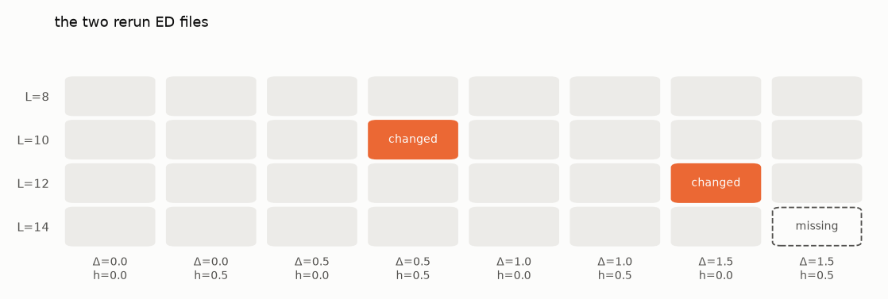

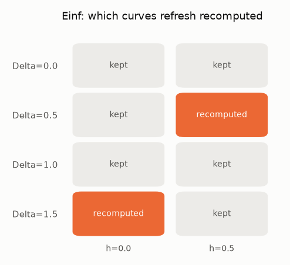

For `Tpeak`, one number per run, that's 2 of 31. For `Einf`, which combines all L at each
(Δ, h), a changed file changes its whole (Δ, h) curve, so it's 2 of 8. glue works this out by
tracing each changed file's path values up the tree: Δ and h reach the result, and L is reduced
away.

### Values that aren't saved update too

Nothing has to be saved for this to work. glue keeps every value it computes, keyed by its node id
and the fingerprints of the files under it. After a change, the next use recomputes only what the
changed files affect:

```glue
plot dX by L where Delta=0.0, h=0.0 with logx > figs/13_before.png
invalidate ed where L=14, Delta=0.0
plot dX by L where Delta=0.0, h=0.0 with logx > figs/13_after.png
```

`invalidate` marks files as changed by hand, for changes that file contents don't show, like a bug
fix you know about. `status --all` also lists the cached values under each name:

```glue
status --all
```

With `set disk_cache true`, expensive values are also kept in `.glue/cache/`, so the next session
starts from them. `gc` deletes cached values that nothing uses anymore. `pin NAME` keeps a
dataset as it is, even when its files change:

```glue
pin Tpeak
refresh --all
unpin Tpeak
gc
```

## 14. Exporting

`export` writes plain data with no recipe. The format comes from the extension. `.dat` writes one
block per curve, which gnuplot reads with `index`:

```glue
export ed.C to exports/C_heisenberg.csv where Delta=1.0, h=0.0
export ed.C to exports/C_heisenberg.dat where Delta=1.0, h=0.0
```

```show exports/C_heisenberg.dat lines=1-5
```

`plot ... with backend=gnuplot > fig.gp` writes a gnuplot script and its data files instead of a
matplotlib figure:

```glue
plot ed.C by L where Delta=1.0, h=0.0 with backend=gnuplot, logx > exports/C.gp
```

## 15. The Python API

Everything above works from Python too. The shell is a thin layer over the same session:

```python
import glue

s = glue.open("project.toml", trust=True)
s.set_setting("duplicates", "first")

r = s.eval("ed.E - exact.E", where="Delta=0.0, h=0.0")
print(r.type)
df = r.to_pandas()
print(df.groupby("L")["value"].agg(["min", "max"]))
print(r.report)
```

`r.tree()` prints the core tree, and names in the session are attributes, so arithmetic builds
the same expressions:

```python
diff = (s.ed.E - s.exact.E).to_pandas(where="L=14, Delta=0.0, h=0.0", method="cubic")
print(len(diff), diff["value"].abs().max())
```

Data you made in Python can join in. `register` makes a DataFrame a table:

```python
import numpy as np, pandas as pd

# the leading term of the high-temperature expansion: C = (2 + Delta^2) / (16 T^2)
T = np.geomspace(0.05, 10, 80)
hte = pd.concat([pd.DataFrame({"Delta": d, "h": 0.0, "T": T, "C": (2 + d**2) / (16 * T**2)})
                 for d in (0.0, 0.5, 1.0, 1.5)])
s.register("hte", hte, by=["Delta", "h"], x="T")
ratio = s.eval("ed.C / hte.C @ T=3.0", where="L=14, h=0.0").to_pandas()
print(ratio.round(3).to_string(index=False))
```

At T = 3 every ratio is close to 1. The rest is the next order of the expansion, which
depends on Δ. Custom operations can be registered inline too:

```python
@glue.op(kind="reduce")
def half_width(x, y):
    """Width of the region where y is above half its maximum."""
    above = x[y >= y.max() / 2]
    return float(above.max() - above.min())

print(s.eval("half_width(ed.C)", where="Delta=1.0, h=0.0").to_pandas())
```

## 16. The command line

```sh
glue status --trust
glue status --all --trust | head -8
```

`Tpeak` is still stale: it was pinned during the last `refresh`. A new process has no cached
values in memory, and this project doesn't use the disk cache, so `--all` finds none.

`glue run SCRIPT.glue` runs a script of shell statements, `glue refresh --all` updates stale
datasets, and `glue` alone starts the interactive shell. There, `help` lists the commands, `help
NAME` explains one, `edit NAME` opens a file in your editor, and `py` drops into Python with the
session loaded.

```glue
help transform
help invalidate
help intercept
```

## 17. How it works inside

### The life of a statement

Take `plot dX by L where Delta=0.0, h=0.0`:

1. **Parse.** `glue/lang.py` turns the text into an expression tree, with the `where` and `with`
   clauses. The language has its own small parser, so `y[U=0.1]` and `y @ T=0.1` work.
2. **Elaborate.** `glue/elaborate.py` translates the expression into a tree of **core
   operations**. This is where the rules of section 7 live: it looks at the operands' types, sees
   that T is ragged and differs, and inserts `align` with the grid from the settings. Every setting
   in effect is written into the nodes as a parameter.
3. **Type.** Each node works out its own type from its inputs, in `glue/core/nodes.py`, before any
   data is read. Errors like "no input J" come from here.
4. **Push filters down.** `where Delta=0.0, h=0.0` is pushed through every node that keeps those
   inputs point by point, down to the sources, which skip the files that don't match
   (`glue/core/context.py`). Filters on T would stop at operations along T, since those need the
   whole curve.
5. **Evaluate.** Nodes are computed from the leaves up. Sources read their files
   (`glue/sources.py`). Each value is stored by (node id, filters, fingerprint), so shared nodes
   are computed once, and a changed file is never missed.
6. **Report and plot.** Operations count what they did to the data, and `glue/plotting.py` draws
   the result.

### Code map

| Module | What it does |
|---|---|
| `glue/lang.py` | The parser for statements, expressions, selectors, and options |
| `glue/elaborate.py` | Surface expressions to core trees: names, arithmetic, alignment, all the functions |
| `glue/core/types.py` | Field types `[inputs → outputs]`, with exact or ragged inputs |
| `glue/core/nodes.py` | The 21 core operations and the standard library, one class each |
| `glue/core/formula.py` | Formulas for `map` and `transform`, and filter predicates |
| `glue/core/context.py` | Evaluation: fingerprints, filter pushdown, the value store, `explain` plans |
| `glue/core/incremental.py` | Tracing changed files to the curves they affect |
| `glue/core/store.py` | The value store in memory and on disk, and `invalidate` marks |
| `glue/core/tree.py` | Writing trees to TOML and reading them back, with id checks |
| `glue/sources.py` | Table files, locators (glob, SQLite, HDF5), readers, the file index |
| `glue/numerics.py` | Interpolation, derivatives, and integrals, on SciPy |
| `glue/dataset.py` | Dataset and calc files, status, refresh |
| `glue/session.py` | Names, projects, settings, and the Python API |
| `glue/shell.py`, `glue/cli.py` | The shell commands and the command line |
| `glue/plotting.py` | Plots with matplotlib or gnuplot |

### Identity

Two rules make saving and caching safe:

- **A node's id comes from its calculation**: its operation, its parameters, and the ids of its
  inputs. A leaf's id comes from what it reads. Names are labels only.
- **A value is reused only when its id and its fingerprint both match.** The fingerprint is a hash
  of the files under the node, plus any `invalidate` marks.

So a calculation gets the same ids whatever its tables are called. Load the ED table a second time
under another name, and compare:

```glue
load tables/ed.toml as ed_copy
```

```python
n1 = session.compile("d(ed.E, T)")[0]
print("same expression again:  ", n1.id == session.compile("d(ed.E, T)")[0].id)
print("same files, other name: ", n1.id == session.compile("d(ed_copy.E, T)")[0].id)
print("a different method:     ", n1.id == session.compile("d(ed.E, T, method=akima)")[0].id)
```

The copy reads the same files, so its values are the same values, and glue knows it. A different
method is a different calculation.

### Where to read more

- [docs/reference.md](../../docs/reference.md): every command, function, and setting
- [docs/spec.md](../../docs/spec.md): the file formats and the language, exactly
- [docs/core.md](../../docs/core.md): the core operations and their laws, saved trees, identity,
  and caching
